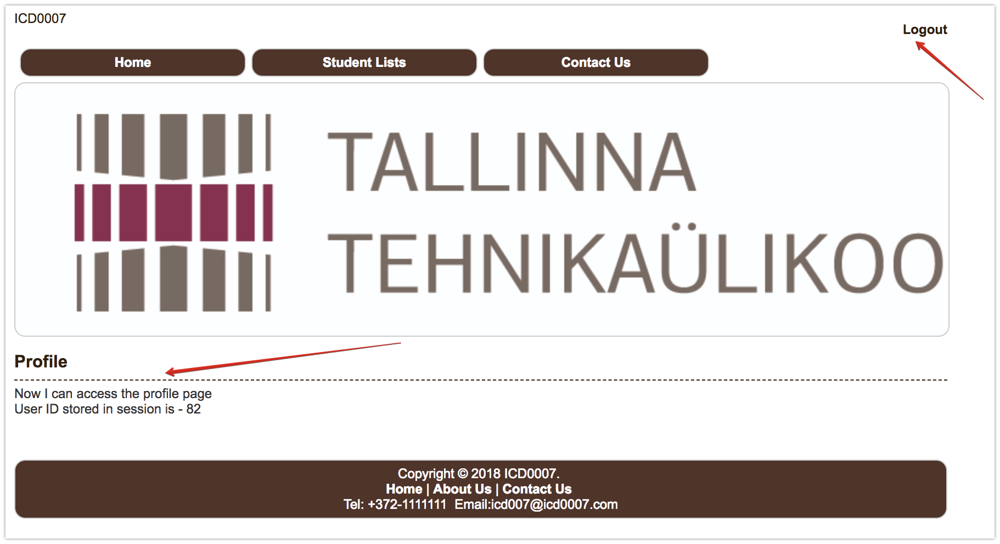

## PHP & MySQL Lab - 13-04-2018

Today, we will continue from where we stopped in our last [lab session](./php-mysql-lab-06-04-2018.md). 

We have implemented the **user registration**, the next thing is to allow the user to login using the `email` and `password` 

provided during the registration.

We will cover the following:

* Update login form to handle form submission

* Implement login handler logic

* Use SQL query to retrieve user information that matches login credentials

* Verify password

* Handling Session

* Access to protected page 

* Navigation across pages when logged in

* User Logout

### 1. Implement Login functionality

Now that we have the registered the user, let's implement the login functionality.

__NOTE__: I will skip the changes that we must do in `login.html`, I think you can figure that out.

You should also rename `login.html` to `login.php`.

i. Let's create the PHP script that will handle the login request. Create a file `loginHandler.php` in `application/`

```php
session_start();

require_once ("database/DatabaseConnection.php");

unset($_SESSION['success_message']);
unset($_SESSION['error_message']);

function login() {
    $postedData = $_POST['data'];

    $email = $postedData['email'];
    $password = $postedData['password'];

    // create PDO connection object
    $dbConn = new DatabaseConnection();
    $pdo = $dbConn->getConnection();

    // retrieve user with the email
    try {
        $statement = $pdo->prepare("SELECT * FROM `users` WHERE email = :email LIMIT 1");
        $statement->bindParam(':email', $email);
        $statement->execute();

        $result = $statement->fetchAll(PDO::FETCH_ASSOC);
        $userData = $result[0];

        // no user matching the email
        if (empty($result)) {
            $_SESSION['error_message'] = 'Invalid email / password!';
            header('Location: /mywebapp/login.php');
            return;
        }

        $userEncryptedPassword = $userData['password'];

        // verify the incoming password with encrypted password
        if (password_verify($password, $userEncryptedPassword)) {
            $_SESSION['isLoggedIn'] = true;
            $_SESSION['userID'] = $userData['id'];
            $_SESSION['success_message'] = 'User successfully';
            header('Location: /mywebapp/profile.php');

            return;
        }
    } catch (PDOException $exception) {
        var_dump($exception->getMessage());
    }

    $_SESSION['error_message'] = 'Invalid email / password!';
    header('Location: /mywebapp/login.php');
}

login();
```

Let's break the code block down a bit and look at some important parts.

#### a. Session

```php
  session_start();
```

When user logged in, we should keep some information about the user as session variable. So we need to start the session.

#### b. Database connection

```php
  require_once ("database/DatabaseConnection.php");
```

Since we need to retrieve user data from the database, we have to require the database connection file which holds the

database connecton class.

#### c. Unset session variables

For every request to this handler, we should clear existing `message session variables`.

```php
  unset($_SESSION['success_message']);
  unset($_SESSION['error_message']);
```

#### d. Login function

i. Here we are creating an instance of the `DatabaseConnection` class so that we can access its `public properties`.

```php
    // create PDO connection object
    $dbConn = new DatabaseConnection();
    $pdo = $dbConn->getConnection();
```

ii. Below, we are using the `pdo` object to execute the query to retrieve the user with the given email.

Also, we are checking if the query result is empty, we do the following: 

- We create a session variable to hold the error message - 

  `$_SESSION['error_message'] = 'Invalid email / password!';`, so that we can display this error message to the user.

- We redirect the user back to login page - `header('Location: /mywebapp/login.php');`

```php
    $statement = $pdo->prepare("SELECT * FROM `users` WHERE email = :email LIMIT 1");
    $statement->bindParam(':email', $email);
    $statement->execute();

    $result = $statement->fetchAll(PDO::FETCH_ASSOC);
    $userData = $result[0];
    
    // no user matching the email
    if (empty($result)) {
        $_SESSION['error_message'] = 'Invalid email / password!';
        header('Location: /mywebapp/login.php');
        return;
    }
```

We can print the error message somewhere above the form on the login page.

```php
    <?php
        if (isset($_SESSION['error_message'])) {
            echo $_SESSION['error_message'];
        }
    ?>
```

Before the code above will work in the `login.php` page, we need to start the session.

Put the code below at the beginning of `login.php` page. 

```php
    <?php
        session_start();
    ?>
```

iii. If the query result returns a record, we need to verify if the password that the user entered is valid. 

Here we make use of the php in-build function `password_verify` to do this. 

Function `password_verify` returns `true` if the password entered, matches the password hash that was retrieved 

from the query result.

Then we set the session variables - 

- `$_SESSION['isLoggedIn'] to true;`

- `$_SESSION['userID'] to $userData['id'] from the query result`

- `$_SESSION['success_message'] to hold login success message`

Lastly we redirect user to profile page, which is a protected page - user should only see this when they are logged in.

```php
    $userEncryptedPassword = $userData['password'];

    // verify the incoming password with encrypted password
    if (password_verify($password, $userEncryptedPassword)) {
        $_SESSION['isLoggedIn'] = true;
        $_SESSION['userID'] = $userData['id'];
        $_SESSION['success_message'] = 'User successfully';
        header('Location: /mywebapp/profile.php');

        return;
    }
```

### 2. Access to protected page

Create a new page `profile.php` insidie the **mywebapp** project directory and put the content below.

```php
    <?php
        if ($_SESSION['isLoggedIn'] !== true) {
            $_SESSION['error_message'] = 'You must be logged in!<br>';
            header('Location: /mywebapp/login.php');
            return;
        }
    ?>
    
    <!DOCTYPE HTML>
    <html>
    <head>
        <title>::Profile::</title>
        <meta http-equiv="Content-Type" content="text/html; charset=utf-8">
        <meta name="description" content="">
        <meta name="keywords" content="">
        <link rel="stylesheet" href="/mywebapp/css/main.css" type="text/css">
        <link rel="shortcut icon" href="/mywebapp/images/favicon.ico?v=2" type="image/x-icon"/>
    </head>
    <body>
    <div id="wrapper">
        <div id="maincontent">

            <div id="header">
                <div id="logo" class="left">
                    <a href="/mywebapp">ICD0007</a>
                </div>
                <div class="right marT10">
                    <b>
                        <a href="/mywebapp/logout.php">Logout</a>
                    </b>
                </div>
                <br><br>
                <ul class="topmenu">
                    <li><a href="/mywebapp">Home</a></li>
                    <li><a href="/mywebapp">Student Lists</a></li>
                    <li><a href="/mywebapp">Contact Us</a></li>
                </ul>
                <br>
                <div class="banner"><p></p></div>
                <br class="clear"/>
            </div>

            <div class="content">
                <br/>
                <div class="content-area">

                    <h2>Profile</h2>
                    <?php
                        echo 'Now I can access the profile page<br>';

                        echo 'User ID stored in session is - ' . $_SESSION['userID'];
                    ?>
                </div>
            </div>

        </div><!-- maincontent -->
        <br>
        <div id="footer">
            <div class="footer">
                Copyright &copy; 2018 ICD0007. <br/>
                <a href="/mywebapp">Home</a> | <a href="about">About Us</a> | <a href="contact">Contact Us</a> <br/>
                <span class="contact">Tel: +372-1111111&nbsp;
                Email:icd007@icd0007.com</span>
            </div>
        </div><!-- footer -->

    </div><!-- wrapper -->

    </body>
    </html>
```

Imagine we have hundreds of pages to protect, we can easily reuse the code in all the pages by extracting the code

in the `if` block to a file and then require the file on all the protected pages.

i. Create a file `protected_access_check.php` inside the project folder **mywebapp** and put the code below.

```php
    <?php
    session_start();
    
    if ($_SESSION['isLoggedIn'] !== true) {
        $_SESSION['error_message'] = 'You must be logged in!';
        header('Location: /mywebapp/login.php');
    }
    ?>
    
    
```

ii. Inside all our protected pages we will just require `protected_access_check.php`.

Put the code below at the beginning of `profile.php`.

```php
   <?php
      require_once ('protected_access_check.php');
   ?>
```

The profile page looks like this



#### Logout

Create a new file `logout.php` and put the code below.

```php
<?php

session_start();

session_unset();
session_destroy();

header('Location: /mywebapp/login.php');
``
